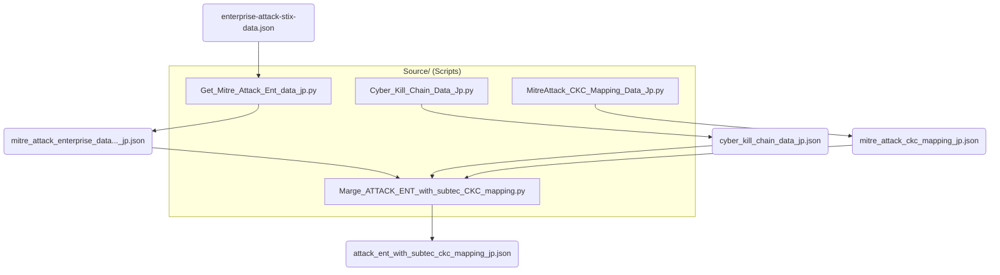
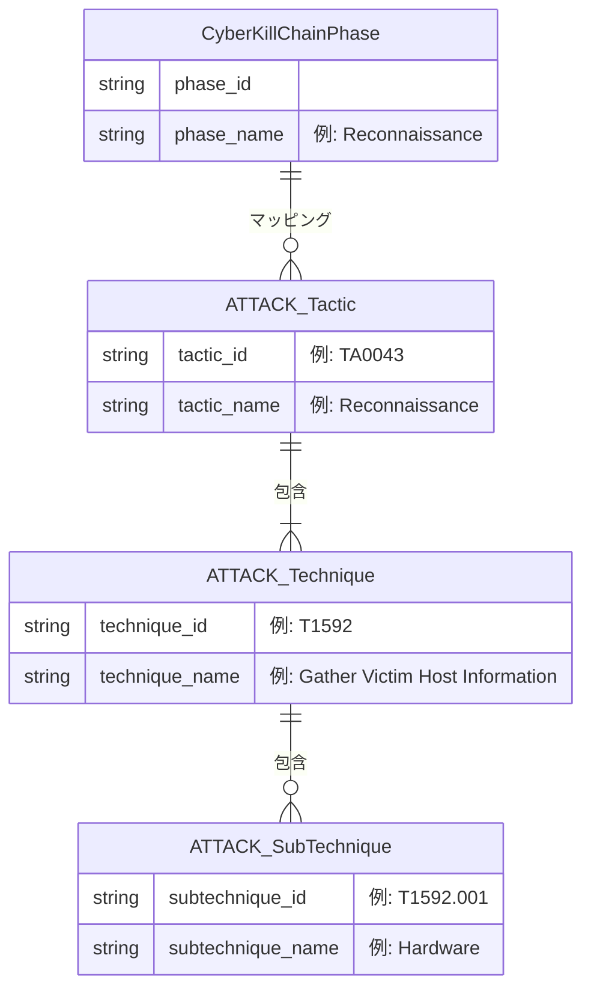

# BaseData_ATTACK_and_CKC

このディレクトリは、MITRE ATT&CK エンタープライズ版データと Cyber Kill Chain (CKC) データを収集・加工・統合するためのサブプロジェクトです。それぞれのフレームワークの利点を取り入れ、攻撃のエンティティとキルチェーンのフェーズをマッピングした構造化データを提供します。

## ディレクトリ構成

### `Data/`
収集やスクリプトによる加工を経て生成されたJSON、CSVなどのデータファイルが格納されています。
- `enterprise-attack-stix-data.json`: オリジナルのMITRE ATT&CKのSTIX形式データ。
- `mitre_attack_enterprise_data_with_subtechniques_eng.json` / `_jp.json`: ATT&CKデータ（サブテクニック含む）の英語/日本語版。
- `cyber_kill_chain_data_jp.json`: Cyber Kill Chain (CKC) の各フェーズを定義したデータ。
- `mitre_attack_ckc_mapping_jp.json`: ATT&CKとCKCを関連付けるためのマッピング定義ファイル。
- `attack_ent_with_subtec_ckc_mapping_jp.json` / `.csv`: ATT&CKデータとCKCのフェーズを結合（マージ）した完成版のデータ。

### `Source/`
データを外部から取得・整形し、相互に関連付けるためのPythonスクリプト群です。
- `Get_Mitre_Attack_Ent_data_eng.py` / `_jp.py`: MITREのSTIXファイルから必要な情報を抽出し、JSON形式として保存します（英語/日本語対応）。
- `Cyber_Kill_Chain_Data_Jp.py`: CKCの規定フェーズを出力します。
- `MitreAttack_CKC_Mapping_Data_Jp.py`: 両フレームワーク間のマッピングリファレンスデータを作成します。
- `Marge_ATTACK_ENT_with_subtec_CKC_mapping.py`: 各データを統合し、最終的なマッピング済みJSONやCSVを出力します。
- `Split_Attack_ckc_mapping_jp.py`: 統合データの処理や分割などを行います。

### `backup/`
プロセッサスクリプト（`data_processor.py` 等）の退避コードや、データ整形テスト用の出力ファイル、その他JSONデータのバックアップが保管されています。

## ワークフロー・役割

主に `Source/` のスクリプト群を実行することで、MITRE ATT&CK の脅威インテリジェンスと、Cyber Kill Chain のフェーズを関連付けます。これにより、自立型のスクリプトやLLMが読み込みやすい形式(JSON/CSV)に統合されたデータ (`Data/` フォルダ配下) を生成・提供することを主目的としています。

### データ生成ワークフロー (Data Flow)

以下の図は、各スクリプトがどのようにデータを取得・生成し、最終的な統合マッピングデータへと繋がっていくかを示しています。

### オブジェクト関連図 (Entity Relationship)

生成される統合データの論理的な構造は、以下のような包含・マッピング関係を持ちます。Cyber Kill Chain のフェーズに対して、ATT&CKの各要素がどのように紐づいているかを表します。

