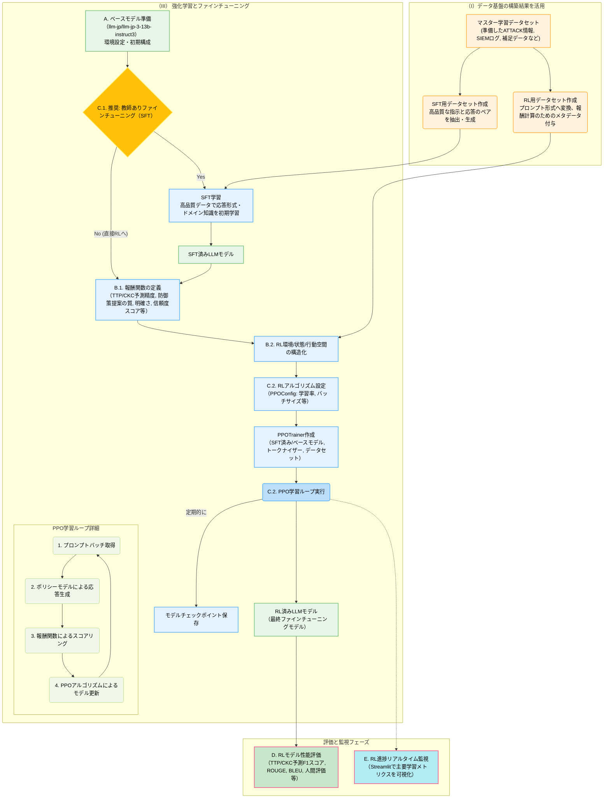

```mermaid
graph TD
    subgraph データ準備フェーズ [（I）データ基盤の構築結果を活用]
        direction LR
        PD1["マスター学習データセット\n(準備したATTACK情報, SIEMログ, 補足データなど)"] --> SFT_Data(SFT用データセット作成<br>高品質な指示と応答のペアを抽出・生成);
        PD1 --> RL_Data(RL用データセット作成<br>プロンプト形式へ変換、報酬計算のためのメタデータ付与);
    end

    subgraph LLMエンパワーメントプロセス [（III） 強化学習とファインチューニング]
        BaseLLM[A. ベースモデル準備<br>（llm-jp/llm-jp-3-13b-instruct3）<br>環境設定・初期構成];

        BaseLLM --> SFT_Phase{C.1. 推奨: 教師ありファインチューニング（SFT）};

        SFT_Phase -- Yes --> SFT_Training[SFT学習<br>高品質データで応答形式・ドメイン知識を初期学習];
        SFT_Data --> SFT_Training;
        SFT_Training --> SFT_Tuned_LLM[SFT済みLLMモデル];

        SFT_Phase -- No (直接RLへ) --> Define_Reward_Function[B.1. 報酬関数の定義<br>（TTP/CKC予測精度, 防御策提案の質, 明確さ, 信頼度スコア等）];

        SFT_Tuned_LLM --> Define_Reward_Function;

        Define_Reward_Function --> RL_Env_Setup[B.2. RL環境/状態/行動空間の構造化];
        RL_Data --> RL_Env_Setup;
        RL_Env_Setup --> RL_Algo_Setup[C.2. RLアルゴリズム設定<br>（PPOConfig: 学習率, バッチサイズ等）];

        RL_Algo_Setup --> Create_PPO_Trainer[PPOTrainer作成<br>（SFT済み/ベースモデル, トークナイザー, データセット）];

        Create_PPO_Trainer --> RL_Loop(C.2. PPO学習ループ実行);

        subgraph PPO学習ループ詳細
            direction TB
            RL_Loop_Start(1. プロンプトバッチ取得) --> Generate_Response(2. ポリシーモデルによる応答生成);
            Generate_Response --> Calculate_Rewards(3. 報酬関数によるスコアリング);
            Calculate_Rewards --> Update_Policy_Model(4. PPOアルゴリズムによるモデル更新);
            Update_Policy_Model --> RL_Loop_Start;
        end
        RL_Loop -- 定期的に --> Save_Checkpoint[モデルチェックポイント保存];
        RL_Loop --> RL_Tuned_LLM[RL済みLLMモデル<br>（最終ファインチューニングモデル）];
    end

    subgraph 評価と監視フェーズ
        RL_Tuned_LLM --> Model_Performance_Evaluation[D. RLモデル性能評価<br>（TTP/CKC予測F1スコア, ROUGE, BLEU, 人間評価等）];
        RL_Loop -.-> Realtime_Progress_Monitoring[E. RL進捗リアルタイム監視<br>（Streamlitで主要学習メトリクスを可視化）];
    end

    classDef data_prep fill:#FFF3E0,stroke:#FFB74D,stroke-width:2px,color:#000;
    classDef llm_process fill:#E3F2FD,stroke:#64B5F6,stroke-width:2px,color:#000;
    classDef decision fill:#FFFDE7,stroke:#FFF176,stroke-width:2px,color:#000;
    classDef model_artifact fill:#E8F5E9,stroke:#81C784,stroke-width:2px,color:#000;
    classDef evaluation fill:#FCE4EC,stroke:#F06292,stroke-width:2px,color:#000;
    classDef loop_detail fill:#F1F8E9,stroke:#AED581,stroke-width:1px,color:#000;


    class PD1,SFT_Data,RL_Data data_prep;
    class BaseLLM,SFT_Tuned_LLM,RL_Tuned_LLM model_artifact;
    class SFT_Training,Define_Reward_Function,RL_Env_Setup,RL_Algo_Setup,Create_PPO_Trainer,RL_Loop,Save_Checkpoint llm_process;
    class Generate_Response,Calculate_Rewards,Update_Policy_Model,RL_Loop_Start loop_detail;
    class SFT_Phase decision;
    class Model_Performance_Evaluation,Realtime_Progress_Monitoring evaluation;

    style SFT_Phase fill:#FFC107,color:black;
    style RL_Loop fill:#BBDEFB,color:black;
    style Model_Performance_Evaluation fill:#C8E6C9,color:black;
    style Realtime_Progress_Monitoring fill:#B2EBF2,color:black;
```