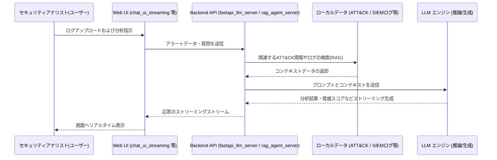
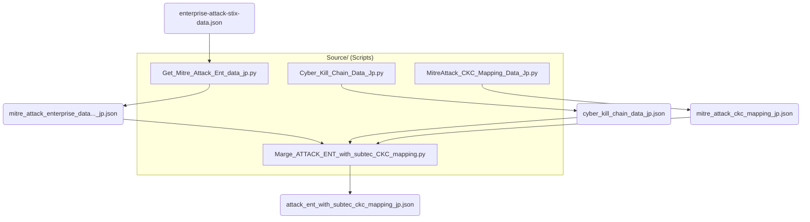
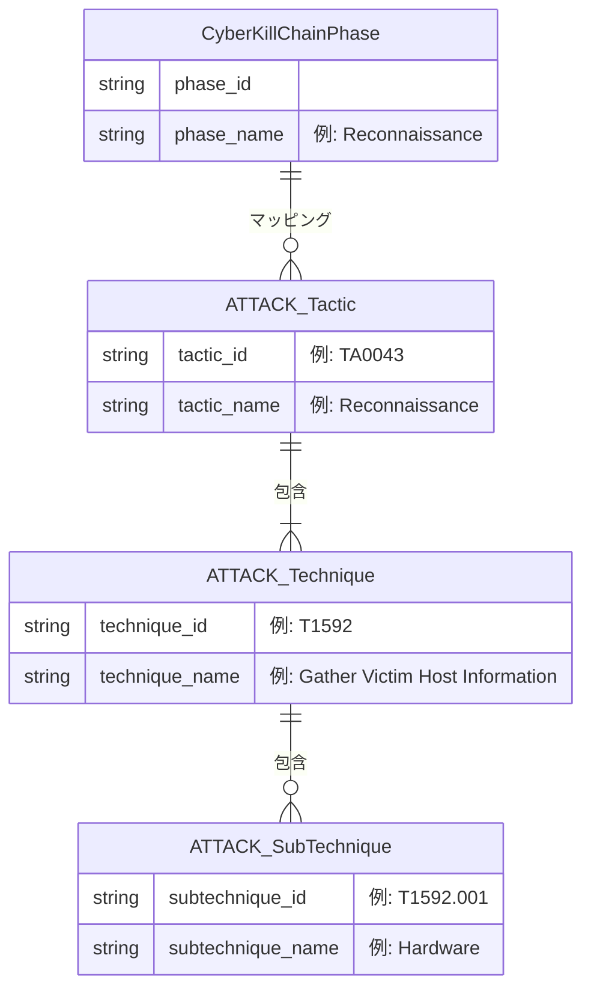
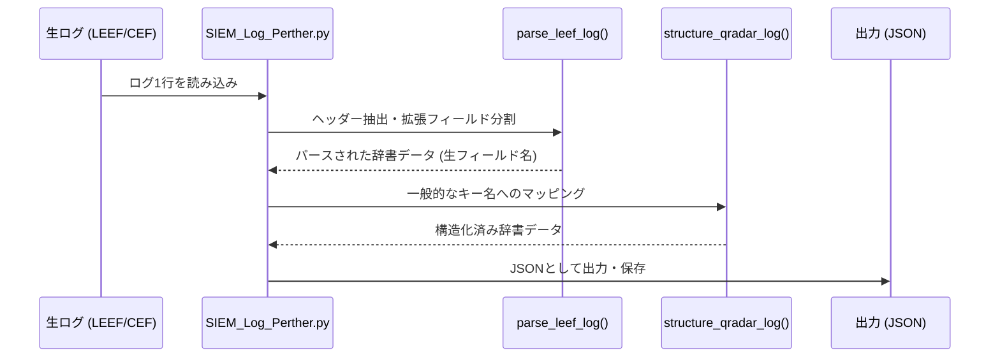
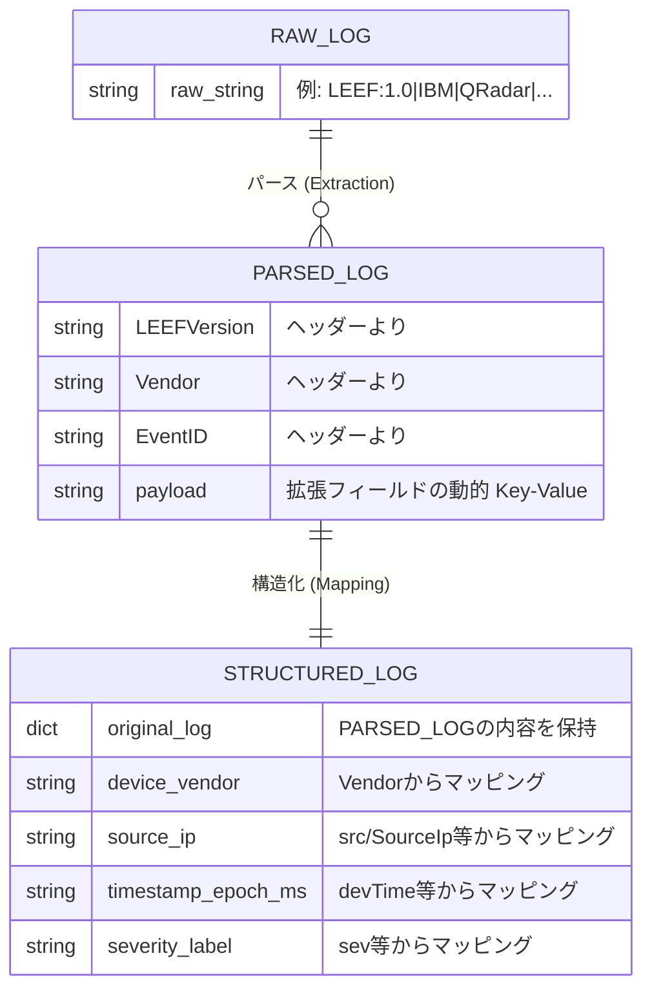

# CASPAP_LLM

このプロジェクトは、最新のサイバーセキュリティ脅威インテリジェンス（MITRE ATT&CK / Cyber Kill Chain）とSIEM機器から出力されるセキュリティログを活用し、LLM（大規模言語モデル）やRAG（Retrieval-Augmented Generation）技術を組み合わせて脅威分析を行うための統合実証システムです。

## 全体アーキテクチャ・シーケンス図 (Sequence Diagram)

フロントエンドのUIからAPIサーバーにリクエストが送られ、LLMがRAGと連携して分析・推論を行う大まかなシステム全体の流れです。



## ディレクトリ・ファイル構成

プロジェクトのルートに含まれる主要なスクリプトファイルおよびデータ群です。

- **`chat_ui_streaming.py`**: ストリーミングレスポンスに対応したLLMとの対話用StreamlitチャットUIアプリケーション。
- **`fastapi_llm_server_CLM.py`**: CLM (Causal Language Model) 向けの推論エンドポイント用のFastAPIサーバー。
- **`fastapi_llm_server_SFT.py`**: SFT (Supervised Fine-Tuning) 済みのLLM推論エンドポイント用のFastAPIサーバー。
- **`rag_agent_server_streaming.py`**: 解析エージェント機能およびRAGを統合し、ストリーミングレスポンスを返すバックエンドAPIサーバー。
- **`streamlit_llm_train.py`**: LLMの評価やファインチューニングの可視化等のためのStreamlitアプリ。
- **`asset_management.csv`**: 分析システム上で使用されるアセット（資産）管理情報のCSVデータ。
- **`BaseData_ATTACK_and_CKC/`**: MITRE ATT&CK と CKC データの収集・統合用サブプロジェクト（詳細は後述）。
- **`SIEM_LEAF_LOG/`**: SIEM ログのパースと構造化を行うサブプロジェクト（詳細は後述）。

### 実行手順

本システム（FastAPIバックエンドおよびStreamlitフロントエンド）をローカルで起動・動作させるための基本的な手順です。

1. **仮想環境の有効化**
   プロジェクトルートディレクトリで仮想環境（`.venv`等）を有効化します。
   ```bash
   # Windows (PowerShell) の場合
   .\.venv\Scripts\Activate.ps1
   ```

2. **バックエンドサーバー (FastAPI) の起動**
   利用する推論エンジン・用途に応じて、エンドポイントを起動します。
   ```bash
   # 例: RAGエージェントのストリーミングサーバーを起動する場合
   uvicorn rag_agent_server_streaming:app --reload --port 8000
   
   # 例: SFTモデルエンドポイントを起動する場合
   uvicorn fastapi_llm_server_SFT:app --reload --port 8000
   ```

3. **フロントエンド (Streamlit) の起動**
   別のターミナルを開き（再度仮想環境を有効化して）、チャットUIなどのStreamlitアプリを起動します。
   ```bash
   streamlit run chat_ui_streaming.py
   ```
   起動に成功すると、ブラウザが自動的に開き（デフォルト `http://localhost:8501`）、チャットUIにアクセスして操作が可能になります。


---

## サブプロジェクト概要

以下は、脅威インテリジェンス統合およびSIEMログ解析を担う各サブディレクトリの詳細な仕様です。

### 1. BaseData_ATTACK_and_CKC

このディレクトリは、MITRE ATT&CK エンタープライズ版データと Cyber Kill Chain (CKC) データを収集・加工・統合するためのサブプロジェクトです。それぞれのフレームワークの利点を取り入れ、攻撃のエンティティとキルチェーンのフェーズをマッピングした構造化データを提供します。

#### ディレクトリ構成

- **`Data/`**: 収集やスクリプトによる加工を経て生成されたJSON、CSVなどのデータファイルが格納されています。
  - `enterprise-attack-stix-data.json`: オリジナルのMITRE ATT&CKのSTIX形式データ。
  - `mitre_attack_enterprise_data_with_subtechniques_eng.json` / `_jp.json`: ATT&CKデータ（サブテクニック含む）の英語/日本語版。
  - `cyber_kill_chain_data_jp.json`: Cyber Kill Chain (CKC) の各フェーズを定義したデータ。
  - `mitre_attack_ckc_mapping_jp.json`: ATT&CKとCKCを関連付けるためのマッピング定義ファイル。
  - `attack_ent_with_subtec_ckc_mapping_jp.json` / `.csv`: ATT&CKデータとCKCのフェーズを結合（マージ）した完成版のデータ。

- **`Source/`**: データを外部から取得・整形し、相互に関連付けるためのPythonスクリプト群です。
  - `Get_Mitre_Attack_Ent_data_eng.py` / `_jp.py`: MITREのSTIXファイルから必要な情報を抽出し、JSON形式として保存します（英語/日本語対応）。
  - `Cyber_Kill_Chain_Data_Jp.py`: CKCの規定フェーズを出力します。
  - `MitreAttack_CKC_Mapping_Data_Jp.py`: 両フレームワーク間のマッピングリファレンスデータを作成します。
  - `Marge_ATTACK_ENT_with_subtec_CKC_mapping.py`: 各データを統合し、最終的なマッピング済みJSONやCSVを出力します。
  - `Split_Attack_ckc_mapping_jp.py`: 統合データの処理や分割などを行います。

#### ワークフロー・役割

主に `Source/` のスクリプト群を実行することで、MITRE ATT&CK の脅威インテリジェンスと、Cyber Kill Chain のフェーズを関連付けます。これにより、自立型のスクリプトやLLMが読み込みやすい形式(JSON/CSV)に統合されたデータ (`Data/` フォルダ配下) を生成・提供することを主目的としています。

##### データ生成ワークフロー (Data Flow)

以下の図は、各スクリプトがどのようにデータを取得・生成し、最終的な統合マッピングデータへと繋がっていくかを示しています。



##### オブジェクト関連図 (Entity Relationship)

生成される統合データの論理的な構造は、以下のような包含・マッピング関係を持ちます。Cyber Kill Chain のフェーズに対して、ATT&CKの各要素がどのように紐づいているかを表します。



---

### 2. SIEM_LEAF_LOG

このディレクトリは、SIEM (Security Information and Event Management) システムから出力される **LEEF (Log Event Extended Format)** や **CEF (Common Event Format)** 形式のログをパース（解析）し、機械学習や分析に利用しやすいようにJSON構造データへ整形するためのツールセットです。

#### ディレクトリ構成

- **`Data/`**: パース処理のテストや実行結果となるデータが格納されています。
  - `Test_SIEM_LEEF_LOG.json`: 解析スクリプトによってパース・構造化されたログのサンプル出力データ。

- **`Source/`**: ログデータを実際に処理するプログラムを含みます。
  - `SIEM_Log_Perther.py`: （※Parser）LEEF形式やCEF形式の文字列を読み込み、正規表現を用いた分離およびキーバリューの抽出を行い、分析しやすい共通のキー（フィールド名）へ構造化するPythonスクリプト。

#### データ処理のシーケンス図 (Sequence Diagram)

スクリプト内で、生のログ文字列からどのように構造化済みJSONに変換されるかの流れを示しています。



#### オブジェクト関連図 (Entity Relationship Diagram)

ログデータが加工される過程で、それぞれのデータ構造がどのような属性と関係性を持つかを表しています。



#### 使用方法概要
`SIEM_Log_Perther.py` を実行するか、外部モジュールとして `parse_leef_log` と `structure_qradar_log` 関数を呼び出すことで、多様なベンダのセキュリティログを正規化されたフィールド体系に変換することができます。
