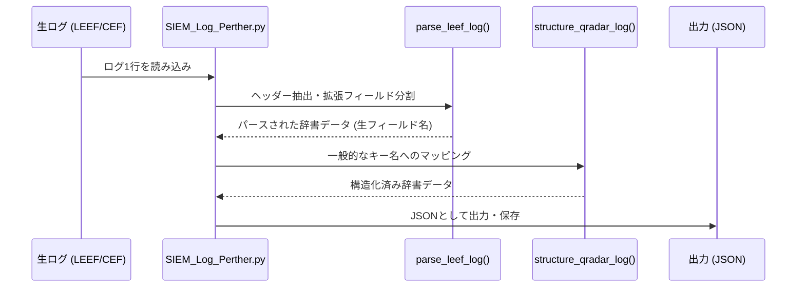
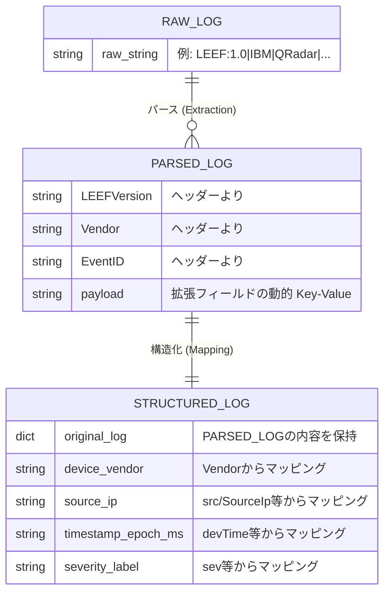

# SIEM_LEAF_LOG

このディレクトリは、SIEM (Security Information and Event Management) システムから出力される **LEEF (Log Event Extended Format)** や **CEF (Common Event Format)** 形式のログをパース（解析）し、機械学習や分析に利用しやすいようにJSON構造データへ整形するためのツールセットです。

## ディレクトリ構成

### `Data/`
パース処理のテストや実行結果となるデータが格納されています。
- `Test_SIEM_LEEF_LOG.json`: 解析スクリプトによってパース・構造化されたログのサンプル出力データ。

### `Source/`
ログデータを実際に処理するプログラムを含みます。
- `SIEM_Log_Perther.py`: （※Parser）LEEF形式やCEF形式の文字列を読み込み、正規表現を用いた分離およびキーバリューの抽出を行い、分析しやすい共通のキー（フィールド名）へ構造化するPythonスクリプト。

---

## データ処理のシーケンス図 (Sequence Diagram)

スクリプト内で、生のログ文字列からどのように構造化済みJSONに変換されるかの流れを示しています。

---

## オブジェクト関連図 (Entity Relationship Diagram)

ログデータが加工される過程で、それぞれのデータ構造がどのような属性と関係性を持つかを表しています。

## 使用方法概要
`SIEM_Log_Perther.py` を実行するか、外部モジュールとして `parse_leef_log` と `structure_qradar_log` 関数を呼び出すことで、多様なベンダのセキュリティログを正規化されたフィールド体系に変換することができます。
